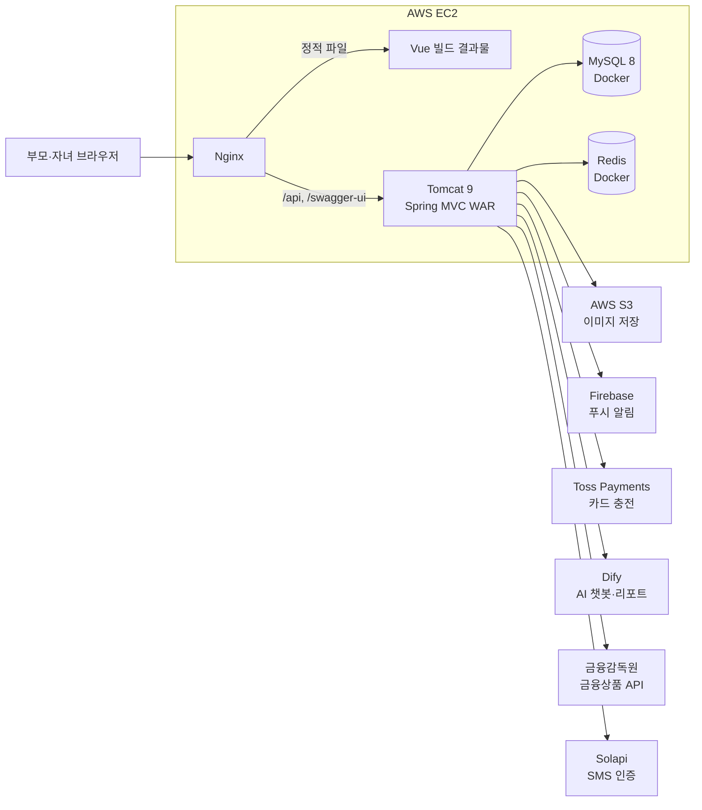

# 티니머니 백엔드 (TeenyMoney Backend)

부모와 자녀가 함께 금융 습관을 만드는 가족 금융 교육 서비스 **티니머니**의 백엔드 저장소입니다.

부모가 일방적으로 소비를 통제하는 대신 자녀가 퀘스트, 금융 활동, 소비 경험으로 신뢰를 쌓고
금융 자율성을 조금씩 넓혀 가도록 돕는 것을 목표로 합니다.

| 항목 | 내용 |
| --- | --- |
| 과정 | KB IT's Your Life 7기 최종 프로젝트 (22회차 4팀, Teenypin) |
| 개발 기간 | 2026년 7월 ~ 8월 |
| 팀 구성 | 6명 (Backend 4, Frontend 2) |
| 개발 통합 서버 | https://www.teenymoney.kro.kr |
| API 문서 | https://www.teenymoney.kro.kr/swagger-ui.html |
| 프론트엔드 저장소 | [TeenyMoney-FrontEnd](https://github.com/KB-PJT-CLASS22-TEAM4/TeenyMoney-FrontEnd) |

## 주요 기능

| 영역 | 기능 | 도메인 패키지 |
| --- | --- | --- |
| 회원·인증 | 회원가입, 휴대폰 SMS 인증, 법정대리인 동의, JWT 로그인·재발급·로그아웃, 약관 조회 | `auth`, `member` |
| 가족 연동 | 부모가 발급한 6자리 코드로 자녀 연결, 연동 해제와 재연동 | `family` |
| 지갑·용돈 | 지갑 잔액과 거래내역, 부모 카드 등록과 충전(Toss Payments), 즉시·정기 용돈 | `wallet`, `charge`, `allowance` |
| 결제 | QR 결제, 결제 비밀번호, 업종 카테고리별 결제 정책(ALLOW·WATCH·BLOCK), 오늘만 허용 요청·승인과 한도 | `payment`, `paymentPassword`, `categoryPolicy`, `permission` |
| 금융상품 | 예금·적금·대출, 부모 맞춤 상품, 가입 승인, 만기·자동 납입·상환 처리, 금융감독원 상품 정보 동기화 | `financialproduct` |
| 퀘스트 | 퀘스트 생성·수락·인증 제출·승인·반려와 보상 지급, 기한이 지난 퀘스트 자동 마감 | `quest` |
| 티니점수 | 금융 활동에 따른 점수와 월간 등급 산정, 등급별 한도와 상품 가입 조건 | `teenyscore` |
| 리포트·AI | 월간 머니 리포트, Dify 기반 소비 분석과 AI 챗봇 | `report`, `chatbot` |
| 알림 | 알림 목록과 설정, FCM 푸시, SSE 실시간 이벤트 | `notification`, `global/sse` |

모든 API는 `/api/v1` 아래에 있으며 전체 명세는 Swagger UI에서 확인합니다.

## 시스템 구성



Nginx가 프론트엔드 정적 파일을 제공하고 API 요청은 Tomcat의 `ROOT.war`로 전달합니다.
현재 EC2는 운영 환경이 아니라 팀 개발 통합 환경입니다.

## 기술 스택

| 구분 | 기술 |
| --- | --- |
| Language | Java 17 |
| Framework | Spring Framework 5.3.37 (Spring MVC, WAR 패키징), Spring Security 5.8.16 |
| Data | MyBatis 3.4.6, MySQL 8, HikariCP, Spring Data Redis (Lettuce) |
| 인증 | JWT, Refresh Token Rotation, Cookie 기반 CSRF |
| 외부 연동 | AWS S3, Firebase Admin (FCM), Toss Payments, Dify, 금융감독원 금융상품통합비교공시 API, Solapi |
| API 문서 | springfox Swagger 2.9.2 |
| Build·Infra | Gradle, AWS EC2 (Ubuntu 24.04), Nginx, Tomcat 9, Docker, GitHub Actions |

## 프로젝트 구조

```text
.
├── .github/                 # Issue·PR 템플릿, CI·배포 workflow
├── docs/                    # 설계·연동·배포 문서
├── sql/
│   ├── schema/              # 현재 전체 스키마
│   ├── migration/           # 순서대로 적용하는 변경 SQL (V001 ~ V032)
│   └── seed/                # 로컬 전용 테스트 데이터
└── src/
    ├── main/java/com/teenyfin/teenymoney/
    │   ├── config/          # Root·Servlet Context, Security, Redis, S3, Firebase, Dify 등
    │   ├── global/          # auth, exception, health, idempotency, response, security, sms, sse, storage
    │   └── domain/          # allowance, auth, categoryPolicy, charge, chatbot, family,
    │                        # financialproduct, member, notification, payment, paymentPassword,
    │                        # permission, quest, report, teenyscore, wallet
    ├── main/resources/      # application.properties, MyBatis 설정과 Mapper XML
    └── test/java/           # 단위·통합 테스트 (테스트 클래스 128개)
```

도메인 패키지는 `controller / dto(request, response) / service / mapper / vo` 구조를 기본으로 하고,
MyBatis Mapper XML은 Java 패키지와 같은 경로의 `src/main/resources` 아래에 둡니다.
상세 규칙은 [프로젝트 구조 문서](docs/PROJECT_STRUCTURE.md)를 참고합니다.

## 핵심 설계

### 인증과 인가

공개 경로를 제외한 모든 요청은 인증이 필요합니다(`SecurityConfig`의 `anyRequest().authenticated()`).
공개 경로의 유일한 기준은 `SecurityConfig.PUBLIC_ENDPOINTS`입니다.

| 경로 | 공개 이유 |
| --- | --- |
| `/api/v1/auth/signup`, `/api/v1/auth/login` | 가입·로그인 전에는 토큰이 없다 |
| `/api/v1/auth/reissue`, `/api/v1/auth/logout` | Access Token이 만료된 상태에서도 Cookie로 처리한다 |
| `/api/v1/auth/csrf` | Cookie 인증 API에 쓸 CSRF 토큰을 발급한다 |
| `/api/v1/auth/check-email`, `/api/v1/auth/phone-verification/send` | 가입 전 이메일 중복 확인과 휴대폰 인증 |
| `/api/v1/auth/legal-guardian-verification/send`, `/confirm` | 가입 전 법정대리인 SMS 인증과 동의 토큰 발급 |
| `/api/v1/terms`, `/api/v1/terms/**` | 가입 전에도 약관을 볼 수 있어야 한다 |
| `/api/v1/health`, `/api/v1/health/**` | 모니터링이 토큰 없이 호출한다 |
| `/api/v1/sse/subscribe` | EventSource는 헤더를 붙일 수 없어 1회용 티켓으로 따로 인증한다 |
| `/swagger-ui.html`, `/webjars/**`, `/swagger-resources/**`, `/v2/api-docs` | Swagger UI와 명세 JSON |

- Access Token은 Redis에 저장된 계정별 **인증 세대**와 일치할 때만 인증됩니다.
  로그아웃하면 그 계정의 세대가 제거되어 기존 Access Token도 즉시 무효화되고, 다른 계정에는 영향이 없습니다.
- Refresh Token은 `HttpOnly; SameSite=Strict` Cookie로만 전달하고 재발급할 때마다 교체합니다.
- 브라우저는 `GET /api/v1/auth/csrf`로 받은 토큰을 로그인·재발급·로그아웃 요청의 `X-XSRF-TOKEN` 헤더에 담습니다.
- 부모와 자녀의 역할에 따라 호출할 수 있는 API를 구분합니다. 예를 들어 연동 코드 발급은 부모만, 코드 입력은 자녀만 가능합니다.

설계 근거는 [JWT·Spring Security 인증 파이프라인](docs/jwt-security-pipeline.md)에 정리했습니다.

### 가족 연동 코드

부모가 발급한 6자리 코드를 자녀가 입력하면 가족 관계가 만들어집니다. 코드가 금융 데이터 접근 권한으로
이어지기 때문에 동시 요청에서도 코드가 엉뚱한 사람에게 연결되지 않도록 여러 겹으로 막았습니다.

- **발급**: `SecureRandom`으로 만든 6자리 코드에 10분 TTL을 적용합니다. 같은 멱등 키로 다시 요청하면 같은 코드를 돌려줍니다.
- **재발급**: 이전 코드의 소유자 확인, 이전 코드 삭제, 새 코드·부모 슬롯·멱등 기록 저장을 **Redis Lua 스크립트 한 번**으로 처리합니다.
  같은 번호가 이미 다른 부모에게 발급된 경우에는 지우지 않으므로, 한 부모의 재발급이 다른 부모의 정상 코드를 삭제하지 못합니다.
- **소비**: `GETDEL`로 코드를 한 번만 소비하고, 자녀별 입력 실패는 10분에 5회로 제한합니다(`INCR + PEXPIRE`를 Lua로 원자 처리).
- **DB 방어선**: `active_child_id` 생성 컬럼의 UNIQUE 제약으로 한 자녀가 활성 관계를 둘 이상 갖지 못하게 합니다.
- **실패 정책**: 코드 소비 후 DB 저장이 실패해도 코드를 되살리지 않습니다(fail-closed). 되살린 코드가 부모의 재발급과 경쟁할 수 있기 때문입니다.

자세한 내용은 [가족 연동 코드 API 연동 안내](docs/FRONTEND_FAMILY_LINK_CODE.md)와
[코드 소비 강화 설계](docs/superpowers/specs/2026-08-06-family-link-consume-hardening-design.md)를 참고합니다.

### 실시간 알림 (SSE + FCM)

- 앱을 보고 있는 사용자에게는 SSE로 이벤트를 보냅니다. EventSource는 `Authorization` 헤더를 붙일 수 없으므로
  `POST /api/v1/sse/ticket`(Bearer 인증)으로 Redis에 저장한 1회용 티켓을 받은 뒤 `GET /api/v1/sse/subscribe`로 구독합니다.
- 연결 유지를 위한 heartbeat(기본 25초)와 emitter 만료 시간(기본 30분)은 환경변수로 조정합니다.
- 앱 밖의 사용자에게는 Firebase Cloud Messaging으로 푸시 알림을 보냅니다.

SSE를 고른 이유는 [SSE를 선택한 이유](docs/SSE_RATIONALE.md)에 정리했습니다.

### 외부 AI 호출 격리

Dify(챗봇·리포트 분석) 호출은 전용 `RestTemplate`(연결 8초, 응답 120초)과 전용 스레드풀을 사용합니다.
Tomcat 워커 스레드가 AI 응답을 기다리며 묶이면 충전이나 로그인 같은 다른 요청까지 막히기 때문에,
기다리는 역할을 별도 스레드로 떼어 냈습니다. 타임아웃 설정도 Toss Payments 호출과 분리해 서로 영향을 주지 않습니다.

### 스케줄러

| 스케줄러 | 기본 주기 | 역할 |
| --- | --- | --- |
| `AllowanceScheduler` | 매일 00:10 | 정기 용돈 지급 |
| `FreeSavingMonthlyScoreScheduler` | 매일 01:00 | 자유적금 월간 점수 반영 |
| `FinancialProductSyncScheduler` | 매일 03:00 | 금융감독원 금융상품 정보 동기화 |
| `FinancialProductMaturityScheduler` | 매일 16:20 | 예금·적금 만기 처리 |
| `LoanRepaymentScheduler` | 매일 16:40 | 대출 상환 처리 |
| `SavingAutoPaymentScheduler` | 매일 17:00 | 적금 자동 납입 |
| `QuestDeadlineScheduler` | 1분 간격 | 기한이 지난 퀘스트 마감 |
| `TeenyScoreGradeScheduler` | 매월 1일 00:00 | 티니등급 산정 |

cron 값은 대부분 `application.properties`의 속성으로 바꿀 수 있습니다. 스케줄러는 서비스·트랜잭션과 함께
Root 컨텍스트에 등록합니다(`RootConfig`의 `@EnableScheduling`).

## 공통 API 응답

모든 REST API는 다음 형식으로 응답합니다.

```json
{
  "success": true,
  "code": "OK",
  "message": "성공",
  "data": {}
}
```

- 실패하면 `success=false`와 서버가 정의한 에러 코드를 반환합니다. 내부 예외 메시지, SQL, 서버 경로는 응답에 담지 않고 로그에만 남깁니다.
- 에러 코드는 `ErrorCode` 인터페이스로 정의합니다. 공통 오류는 `CommonErrorCode`, 도메인 오류는 `domain/<도메인>/exception`의 enum이 담당합니다.
- 성공 응답의 `code`는 `OK` 하나만 사용합니다.

## 로컬 개발 환경

### 필수 항목

- JDK 17
- MySQL 8
- Redis
- Tomcat 9 (IntelliJ 실행 구성 권장)

### 저장소 복제와 DB 준비

```bash
git clone https://github.com/KB-PJT-CLASS22-TEAM4/TeenyMoney-Backend.git
cd TeenyMoney-Backend
```

로컬 MySQL에 `sql/schema/teenymoney_schema_renamed.sql`을 적용한 뒤 `sql/seed`의 파일을 번호 순서대로 실행합니다.
자세한 순서와 주의사항은 [SQL 변경 관리 문서](sql/README.md)를 참고합니다.

### 환경변수

값은 IntelliJ 실행 구성, 운영체제 환경변수 또는 Tomcat 실행 환경에 주입하고 저장소에는 커밋하지 않습니다.

**기본값이 없어 반드시 설정해야 하는 값**

| 변수 | 설명 |
| --- | --- |
| `DB_URL`, `DB_USERNAME`, `DB_PASSWORD` | MySQL 접속 정보 |
| `JWT_SECRET` | Base64로 인코딩한 서명 키. 없으면 애플리케이션이 기동하지 않습니다 |
| `COOKIE_SECURE` | Refresh Token 쿠키의 `Secure` 속성. 로컬 HTTP는 `false`, HTTPS 배포는 `true` |
| `FCM_KEY` | Firebase Admin 인증 정보 |

**기능별 선택 값** (기본값이 있거나 비워 두면 해당 기능만 동작하지 않습니다)

| 구분 | 변수 |
| --- | --- |
| DB·Redis | `DB_DRIVER`, `REDIS_HOST`, `REDIS_PORT`, `REDIS_PASSWORD` |
| JWT | `JWT_ACCESS_EXPIRATION_MS`(기본 30분), `JWT_REFRESH_EXPIRATION_MS`(기본 14일) |
| SMS 인증 | `SOLAPI_API_KEY`, `SOLAPI_API_SECRET`, `SOLAPI_SENDER_NUMBER`, `SMS_TEST_MODE`, `SMS_TEST_CODE`, `SMS_VERIFICATION_TTL_SECONDS`, `SMS_MAX_ATTEMPTS`, `SMS_RESEND_COOLDOWN_SECONDS`, `LEGAL_GUARDIAN_CONSENT_TOKEN_TTL_SECONDS` |
| 충전 | `TOSS_BASE_URL`, `TOSS_SECRET_KEY`, `CHARGE_BILLING_KEY_ENCRYPTION_KEY` |
| 금융상품 | `FINLIFE_API_KEY`, `FINLIFE_BASE_URL`, `FINLIFE_TOP_FIN_GROUP_NO`, `FINLIFE_SYNC_INITIAL_DELAY_MS`, `FINLIFE_SYNC_FIXED_DELAY_MS` |
| AI | `DIFY_API_KEY`, `DIFY_REPORT_API_KEY`, `DIFY_BASE_URL`, `DIFY_CONVERSATION_OWNER_TTL_MINUTES` |
| 파일·실시간 | `AWS_REGION`, `SSE_EMITTER_TIMEOUT_MS`, `SSE_HEARTBEAT_INTERVAL_MS` |

- `JWT_SECRET`은 `openssl rand -base64 32`로 만들고 로컬과 배포 환경에서 서로 다른 값을 씁니다. 인스턴스를 늘리면 모든 인스턴스가 같은 값을 가져야 하고 서버 시각(NTP)도 맞아야 합니다.
- `REDIS_PASSWORD`는 `requirepass`가 걸린 서버에서만 필요합니다. 값이 틀려도 앱은 뜨고 **첫 Redis 명령에서** `NOAUTH`로 실패합니다.
- `TOSS_SECRET_KEY`와 `CHARGE_BILLING_KEY_ENCRYPTION_KEY`는 개발용 기본값이 있지만 배포 환경에서는 반드시 별도 값을 주입합니다.

### 빌드와 테스트

```bash
./gradlew clean test war        # macOS, Linux
.\gradlew.bat clean test war    # Windows PowerShell
```

결과물은 `build/libs/ROOT.war`에 생성됩니다. IntelliJ Tomcat으로 실행할 때는 애플리케이션 컨텍스트 경로를 `/`로 설정합니다.

| 구분 | 로컬 주소 |
| --- | --- |
| 애플리케이션 상태 | `http://localhost:8080/api/v1/health` |
| 데이터베이스 상태 | `http://localhost:8080/api/v1/health/db` |
| Swagger UI | `http://localhost:8080/swagger-ui.html` |
| OpenAPI JSON | `http://localhost:8080/v2/api-docs` |

API를 추가하거나 바꿀 때는 Controller의 `@Api`, `@ApiOperation`과 DTO의 `@ApiModel`, `@ApiModelProperty`를 함께 갱신합니다.
프론트엔드 연동 기준은 [프론트엔드 API 연동 안내](docs/FRONTEND_DEV.md)를 참고합니다.

## CI/CD

| Workflow | 실행 시점 | 하는 일 |
| --- | --- | --- |
| [CI](.github/workflows/ci.yml) | `dev`, `main` 대상 PR, `main` push, 수동 실행 | 필수 파일·민감 파일 검사, Java 17 테스트와 `ROOT.war` 빌드 |
| [Deploy development](.github/workflows/deploy-dev.yml) | `dev` push, 수동 실행 | 테스트·빌드 후 EC2에 WAR 배포, 헬스 체크, 실패 시 자동 복원 |

개발 서버 배포는 다음 순서로 진행됩니다.

1. 테스트와 WAR 빌드를 실행하고 SHA-256 값을 기록합니다.
2. GitHub OIDC로 AWS 역할을 받아 러너 IP를 보안 그룹에 임시로 허용합니다.
3. WAR를 EC2로 전송하고 파일명의 Git SHA와 SHA-256 값을 다시 검증합니다.
4. 기존 WAR를 백업한 뒤 Tomcat을 재시작하고 `/api/v1/health`, `/api/v1/health/db`, 공개 URL을 확인합니다.
5. 헬스 체크에 실패하면 직전 WAR로 자동 복원합니다. 백업은 최근 5개만 보관합니다.
6. 성공 여부와 관계없이 임시 SSH 키와 보안 그룹 규칙을 회수합니다.

운영 방법은 [GitHub Actions 운영 문서](.github/workflows/README.md)와 [EC2 배포와 환경 설정](docs/DEPLOY.md)을 참고합니다.

## 데이터베이스 관리

- Flyway는 아직 도입하지 않았습니다. `sql/migration`의 파일을 담당자가 순서대로 직접 적용합니다.
- 개인 기능 개발과 SQL 실험은 각자의 로컬 MySQL에서 진행하고, EC2 MySQL에는 PR 검토를 마친 SQL만 반영합니다.
- EC2에 적용한 migration 파일은 수정하지 않고 다음 번호의 파일을 추가합니다.
- 실제 개인정보, 운영 계정, 비밀번호를 SQL과 문서에 넣지 않습니다.

## 협업 규칙

- `main`, `dev`에는 직접 push하지 않고 Issue 단위 브랜치에서 작업한 뒤 PR로 병합합니다.
- PR은 CI(`repo-policy`, `backend-build`)와 코드 리뷰를 통과해야 병합합니다.
- 브랜치 이름은 `<이슈번호>-<타입>-<담당자이니셜>-<작업요약>` 형식을 씁니다. 예: `7-chore-psh-github-templates`
- 커밋 메시지는 `feat`, `fix`, `refactor`, `docs`, `test`, `chore` 접두어를 씁니다.
- PR 제목은 `type(scope): 변경 내용` 형식을 쓰고, `scope`에는 `auth`, `family`, `wallet`, `quest`, `infra` 같은 변경 영역을 적습니다.
- Issue의 작업 종류, 우선순위(`Priority`, `Effort`), 일정(`Start date`, `Target date`)은 Organization 설정으로 관리합니다.

## 보안 원칙

- 비밀번호, JWT Secret, DB 자격증명, SSH 키, 결제 키를 저장소와 로그에 남기지 않습니다.
- 토큰 값과 서명 키를 로그에 출력하지 않습니다. 인증 필터에 로거를 두지 않은 이유입니다.
- 클라이언트가 보낸 회원 ID와 권한을 그대로 믿지 않고 인증 정보(`MemberPrincipal`)로 확인합니다.
- 금융 요청에는 트랜잭션과 멱등성을 적용합니다.
- `/api/v1/health/db`는 개발 통합 확인용입니다. 운영 환경에서는 공개 범위와 응답 정보를 다시 검토해야 합니다.

## 문서

| 문서 | 내용 |
| --- | --- |
| [PROJECT_STRUCTURE.md](docs/PROJECT_STRUCTURE.md) | 백엔드 구조와 개발 규칙 |
| [LOCAL_TEST.md](docs/LOCAL_TEST.md) | 로컬 빌드와 API 확인 |
| [DEPLOY.md](docs/DEPLOY.md) | EC2 배포와 환경 설정 |
| [FRONTEND_DEV.md](docs/FRONTEND_DEV.md) | 프론트엔드 API 연동 안내 |
| [FRONTEND_FAMILY_LINK_CODE.md](docs/FRONTEND_FAMILY_LINK_CODE.md) | 가족 연동 코드 API 연동 안내 |
| [jwt-security-pipeline.md](docs/jwt-security-pipeline.md) | JWT·Spring Security 인증 파이프라인 설계 |
| [SSE_RATIONALE.md](docs/SSE_RATIONALE.md) | SSE를 선택한 이유 |
| [QUEST_FEATURE_DESIGN.md](docs/QUEST_FEATURE_DESIGN.md) | 퀘스트 기능 전체 인수인계 문서 |
| [ISSUE_104_IMPLEMENTATION_REPORT.md](docs/ISSUE_104_IMPLEMENTATION_REPORT.md) | 이슈 #104 구현 보고서 |
| [sql/README.md](sql/README.md) | SQL 변경 관리 |
| [.github/workflows/README.md](.github/workflows/README.md) | GitHub Actions 운영 |

## 팀

| 역할 | GitHub | 주요 담당 |
| --- | --- | --- |
| 팀장 · Backend | [@we5046](https://github.com/we5046) | 프로젝트 기반과 공통 응답·예외, 인증·회원, 가족 연동, 퀘스트, SSE, CI/CD와 EC2 배포 |
| Backend | [@wjdgh123](https://github.com/wjdgh123) | 금융상품(예금·적금·대출), 티니점수 |
| Backend | [@dkzndkqh](https://github.com/dkzndkqh) | 지갑·충전, 용돈, 머니 리포트 AI 분석, AI 챗봇 |
| Backend | [@kimjm9841](https://github.com/kimjm9841) | 카테고리 결제 정책, 오늘만 허용, 결제·결제 비밀번호, 알림 |
| Frontend | [@yxngbxyxn1003](https://github.com/yxngbxyxn1003) | 부모 화면, 회원가입·로그인 |
| Frontend | [@soobin-shin](https://github.com/soobin-shin) | 자녀 화면 |

## 프로젝트 성격

KB IT's Your Life 교육 과정의 팀 프로젝트로 제작했습니다. 별도의 오픈소스 라이선스는 부여하지 않았습니다.
